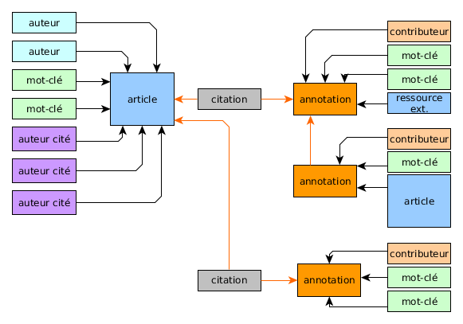

<!-- TOC depthFrom:2 depthTo:3 withLinks:1 updateOnSave:1 orderedList:0 -->

- [Intention](#intention)
	- [Axe 1 : Lire](#axe-1-lire)
	- [Axe 2 : Explorer](#axe-2-explorer)
	- [Axe 3 : Converser / discuter / critiquer](#axe-3-converser-discuter-critiquer)
	- [Axe 4 : Collectionner](#axe-4-collectionner)
	- [Axe 5 : Connecter](#axe-5-connecter)
- [Un site à deux entrées](#un-site-deux-entres)
- [Les différents objets du site](#les-diffrents-objets-du-site)
	- [Disposition](#disposition)
	- [Définitions](#dfinitions)
- [Spécifications](#spcifications)
	- [Principe pour l'inter-connexion](#principe-pour-linter-connexion)
- [Meta-navigation](#meta-navigation)
	- [Institutionnel](#institutionnel)
	- [Types de contenu](#types-de-contenu)
	- [Thématiques](#thmatiques)
	- [Classes de mots-clés dans SPIP](#classes-de-mots-cls-dans-spip)
	- [idRubriques](#idrubriques)
- [HOME](#home)
- [Pages](#pages)
	- [Page article](#page-article)
	- [Page essai](#page-essai)
	- 
	- [Page auteur](#page-auteur)
	- [Page meta](#page-meta)
	- [Page Recherche](#page-recherche)
	- [Page Résultats de recherche](#page-rsultats-de-recherche)
	- [Page mot-clés thématique (voir mots-4.html)](#page-mot-cls-thmatique-voir-mots-4html)
	- [Page mot-clés (voir mots.html)](#page-mot-cls-voir-motshtml)
	- [Page Tous les auteurs](#page-tous-les-auteurs)
	- [Flux RSS](#flux-rss)
	- [Page plan du site](#page-plan-du-site)
	- [Pages Rubrique](#pages-rubrique)

<!-- /TOC -->

# Cahiers des charges Sens Public (revue scientifique en ligne)

## Intention

Avant d'être une revue scientifique, Sens Public s'est toujours positionnée comme un réseau de personnes. Cette particularité demeure un objectif central pour la refonte du site : connecter des personnes et ouvrir un espace public de discussion. La revue est donc l'espace d'articulation entre des énoncés, une communauté et leur conversation ; un espace où du _sens public_ peut justement se produire.

Le site de la revue doit se déployer selon 5 axes :

  1. Lire
  2. Explorer
  3. Discuter
  4. Collectionner
  5. Connecter

Les 5 axes fonctionnent ensemble et sont interdépendants.

### Axe 1 : Lire
Le premier axe «Lire» repose sur les textes eux-mêmes. Il consiste à rendre le corpus des articles de la revue consultable sous différents formats. Les articles seront stockés au format XML, exposés avec leurs métadonnées par le biais du framework Synopsx, permettant de construire une API sur un corpus de ressources XML.

### Axe 2 : Explorer
Le second axe «Explorer» repose sur les métadonnées des ressources, également présentes dans les XML des articles. Il s'agit de proposer des navigations possibles, au sein du corpus et vers l'extérieur, selon plusieurs parcours :
1. la méta-navigation de la revue :
  * les types de contenus: essais, chroniques, dossiers, etc. voir [Types de contenus](#types-de-contenu))
  * les thématiques (au nombre de 5 actuellement)
  * les langues
  * ...
2. des rebonds internes (d'article à article) à partir des métadonnées de l'article : auteur, keyword, ...
3. des rebonds externes en exploitant la richesse sémantique des articles liée à diverses autorités. Ces éléments doivent permettre d'effectuer des requêtes précises dans des moteurs spécialisés, notamment rechercheisidore.fr.
4. des rebonds internes à travers les annotations (voir axe 3), les collections (voir axe 4) et les connexions (voir axe 5)

### Axe 3 : Converser / discuter / critiquer
Le troisième axe «Converser» se base sur l'outil d'annotation Hypothes.is[^hypotesis], lui-même basé sur la librairie Annotator.js. Outre un accès ergonomique et intégré de l'outil d'annotation au fil de la lecture d'un texte, nous souhaitons pouvoir renverser le paradigme de navigation de la revue scientifique, basé traditionnellement sur les articles, en proposant comme point d'entrée principal la conversation. L'API d'Hypothes.is nous permet en effet d'exposer les annotations avec toutes leurs métadonnées (fragment et URI de la source annotée, auteur de l'annotation, mots-clé, commentaire, date/heure, etc.).

Un effort particulier de conception et de présentation de cette conversation doit être apporté. Il faut prévoir à la fois une intégration fine et ergonomique des textes et de leur conversation, et à la fois la possibilité de changer de point de vue et d'adopter celui de la conversation. De cette manière, la conversation est susceptible de ne pas être accessoire aux textes, mais de devenir le point d'accroche de la communauté de lecteurs, de développer une pratique critique collective, ainsi que des dialogues inter-culturels (en considérant des passerelles linguistiques). La conversation et les articles peuvent alors constituer les deux faces d'une même pièce.

[^hypotesis]: Il s'agit d'un outil d'annotation intra-textuel produisant des annotations indexées c'est-à-dire possédant une URI propre et requêtable via une API dédiée.

Un des objectifs de cet axe «Discuter» est de susciter une démarche critique dans les pratiques d'annotations. Une piste à explorer pourrait être de catégoriser[^categoriser] les annotations et la conversation en général. Mais la dynamique critique, en tant que démarche d'appropriation, pourrait également se manifester dans l'axe «Collectionner».

[^categoriser]: sur le mode de [polemictweet](http://polemictweet.com/) où certains tags ou attributs de l'annotation appartiennent à un vocabulaire contrôlé permettant de qualifier la valeur critique d'une annotation.

Un effort de modélisation de la conversation serait ici nécessaire :

* identifier les primitives
* définir des catégories
* définir des scénarios d'annotation
* définir des parcours de lecture dans les annotations.

Catégories (même pas un premier jet):
  * d'accord/pas d'accord
  * "ca me fait penser à" : associer.
    principe : baser la discussion sur la connexion, pour que les deux s'alimentent.
    possibilité d'aller chercher la source parmis des référentiels (DOI, Isidore, ...)
  * intégrer une partie bibliographique + aspects autorité.

> C'est l'idée de lien. on ouvre à la bibliothèque, à l'archive. Dimension référentielle et associative.  
> (commentaire Gérard)  

### Axe 4 : Collectionner

Cet axe proposera au lectorat de créer des collections d'élements qui pourront être soit des fragments d'articles, soit des annotations (propres ou appartenant à d'autres utilisateurs). Cet axe fait se croiser deux contributions théoriques, celle d'_anthologie_ de Milad Doueihi et celle de _cristal de connaissance_, _«crystal of knowledge»_ de JC. Guédon[^guedon].

[^guedon]: Stern, Niels, Jean-Claude Guédon et Thomas Wiben Jensen. « Crystals of Knowledge Production. An Intercontinental Conversation about Open Science and the Humanities ». Nordic Perspectives on Open Science 1, no 0 (23 octobre 2015), 1‑24. doi:10.7557/11.3619.

Si la collection ne relève pas de la production d'un texte nouveau, elle relève bien malgré tout d'une démarche critique dans la mesure où le lecteur construit sa propre interprétation d'un champs ou d'un concept, en y agrégeant des éléments de connaissances glânés au fil de ses lectures. C'est l'association de ces éléments qui est herméneutique, au sens où il construit du sens. On pourrait envisager que ces collections puissent être soit publiques, soit privées, selon la volonté du collectionneur.

Une collection publique revient à un acte de publication par lequel le lecteur se fait éditeur de fragments en proposant un chemin de lecture propre.

### Axe 5 : Connecter
Le quatrième axe «Connecter» consiste à favoriser la création d'un espace public en favorisant les connexions entre auteurs et lecteurs d'une part, mais aussi au sein de la communauté de lecteurs, et par extension avec les personnes impliquées indirectement (par voie bibliographique) dans les articles.

Cet axe est donc une condition de possibilité de l'axe «Converser» car préalablement à la discussion scientifique, il notifie les uns et les autres des prises de position, des emprunts ou encore des citations, il suscite des intérêts et permet de les partager.

Cet axe repose à nouveau sur la richesse sémantique des métadonnées de l'article (ou des annotations), par exemple de la bibliographie, permettant d'identifier des individus et d'effectuer des requêtes sur différents services (Orcid, Zotero, Twitter, GG Scholar), et finalement de générer semi-automatiquement des notifications aux différents acteurs en présence (auteur de l'article, auteurs cités, lecteurs).

## Un site à deux entrées

Ces cinq axes définissent les grands principes de fonctionnement du site. Ces principes auront valeur de matrice dispositive, dont un des enjeux majeurs reste l'éditorialisation du social et son articulation avec le documentaire. Nous explorons la piste d'un site à deux entrées, accompagnant ainsi deux pratiques existantes et complémentaires de consultation et de participation :

1. 1 entrée documentaire, selon une organisation classique centrée sur l'article agencé en dossiers et rubriques.
2. 1 entrée sociale et conversationnelle, agencée autour de problématiques soulevées par la revue.

Pour nous aider à visualiser ces deux modalités de la revue, on peut les penser comme deux projections d'un même ensemble de contenus (fragments, contributions, documents, personnes), l'un mettant l'accent sur les échanges sociaux, et l'autre sur les productions documentaires.

La notion de «cristal de connaissance», [telle que discutée lors de notre entretien avec Jean-Claude Guédon](http://nicolassauret.net/carnet/2017/04/12/entretien-avec-jean-claude-guedon-on-crystal-of-knowledge/), nous aide ici à concevoir comme la partie sociale peut-être éditorialisée.

## Les différents objets du site

### Disposition

Les deux schémas suivants sont à titre indicatif et présentent deux scénarios :
* un article tel qu'il sera accessible dans l'entrée documentaire, et les objets directement associés
* un cristal tel qu'il sera accessible dans l'entrée conversationnelle, les objets directement associés, et les objets agrégés.

_Scénario Article_

_Scénario Cristal_

Voir la spécification succincte des différents objets [ci-dessous][#dfinitions]

### Définitions

**Article**

Un article est l'élément documentaire de base, sur lequel repose la revue d'un point de vue institutionnelle. Il est caractérisé de manière classique par un titre, un résumé, des mots-clés, un corps de texte, des notes de bas de page, une bibliographie, un auteur, etc, ainsi que par un certain nombres de métadonnées d'ordre documentaire ou bibliothéconomique (rubrique, dossier, etc.). L'article pourra enrichi par un balisage sémantique des entités nommées, de l'identification de fragments clés, etc. A partir de ces différents éléments, pourront être inférés des enrichissements connexes susceptibles d'enrichir le réseau de documents et de personnes : les auteurs cités, des documents connexes internes (Sens Public) et/ou externe (le web).

**Annotation**

Une annotation est généralement liée à un document. Elle pourra cependant être liée spécifiquement à un _cristal_ dans le cadre d'une discussion "libre" sur la problématique du-dit cristal. On distingue alors les "annotations d'article" et les "annotations de cristal". Elle se caractérise par :

  * un lien à la source,
  * une citation du document qui vient constituer un fragment d'article
  * un commentaire critique ou informationnel de l'annotateur
  * des mots-clés
  * un contributeur (l'annotateur ou l'auteur de l'annotation)

**Cristal**

Le cristal doit être pensé comme la cristallisation de fragments autour d'une problématique donnée, qu'elle soit identifiée par l'équipe éditoriale ou par la communauté.
Un cristal est l'aggrégation d'un ensemble de fragments : annotations de cristal (constituant le.s fil.s de discussion), annotations d'article, articles, fragments de document, ressources externes, participants (contributeurs).
La dimension temporelle du flux de la discussion reste structurante, mais s'articule avec une dimension spatiale, celle de l'agencement des différents fragments du cristal. Il est donc le résultat d'une éditorialisation à la fois :

1. éditoriale : sélection de mots-clés, paramétrage de l'algorithme, mise en avant d'éléments pertinents (fils de discussion)
2. communautaire : contributions de contenus (ressources et fragments), vote/classement des différents fragments.
3. algorithmique : extraction, classement et agencement des différents fragments (requêtes API).

Il se caractérise par :

  * un titre
  * une description succincte : problématique soulevée
  * des mots-clés
  * l'agrégation de fragments, et en particulier :
    * fil.s de discussion.s, composé des annotations directement liées au cristal
    * annotation.s d'article et fil.s de discussion associé.s
    * articles et fragments d'article
    * ressources externes

**Auteur**

Un auteur est l'auteur d'un article, et par extension tout auteur cité en bibliographie des articles. Il se caractérise par un nom et un prénom, et un ou plusieurs identifiants vers des autorités (Orcid, idHal, Viaf, Foaf, Isni, etc.).

L'auteur d'article est directement engagé dans les discussions sur l'article. Une page dédiée présente l'auteur, ses articles SP, articles externes, et contributions dans la discussion.

**Auteur cité**

Un auteur cité est un auteur cité en bibliographie des articles. Il se caractérise par un nom et un prénom, et un ou plusieurs identifiants vers des autorités (Orcid, idHal, Viaf, Foaf, Isni, etc.).
L'auteur cité pourra être notifié et invité à participer à la discussion.

Plusieurs possibilités :
1. une page dédiée présente l'auteur, ses articles SP, articles externes, et contributions dans la discussion.
2. un lien vers la page Orcid publique accompagne le nom de l'auteur en bibliographie.
3. sur action du lecteur, un encadré récupère et affiche les principales informations liées à l'auteur (via API Isidore ou Orcid).

**Contributeur**

Un contributeur désigne tout participant ayant pris part aux discussions sur la plateforme SP. Il peut être un auteur.
Modalités d'identification : Hypothes.is ? Besoin d'un service tout à fait transparent sur l'utilisation des données.

**Ressource externe**

Une ressource externe est tout élément apporté soit par une contribution de type annotation _(nécessité d'une caractérisation des annotations ?)_, soit par extraction via des services dédiés (Isidore par exemple).

**Rubrique**

La rubrique est utilisée dans l'organisation éditoriale de l'entrée documentaire de la plateforme.

---

## Spécifications

### Principe pour l'inter-connexion
<!-- copier-coller de ton mail en attendant mieux -->
* Récupérer le plus d'infos possibles sur chaque personne citée: blog, page institutionnelle, orcid, twitter, Facebook, mail, autres articles, scholar, autres articles qui le citent profil hypothesis. À faire sur stylo. Au niveau auteur et en rajoutant une couche éditoriale
* Donner la possibilité au lecteur de le notifier. Notifier via annotations sur lui sur hipothesis.

* Connecter en premier des personnes à partir d'une ressource pour ensuite connecter des ressources et déclencher un travail d'annotations et de discussion

* Toutes les autres infos sur l'article - mots clés, citabilité etc, doivent été fonctionnelles à cette possibilité de connexion.

* Imaginer ensuite la possibilité de se créer un profil sens public qui sera justement un agrégateur de profils existants sur d'autres plateformes - oui ça demande la création d'un cms social... mais ça peut être fait en un second temps.

## Meta-navigation

### Institutionnel

* Qui?
* liens
* Publier
* Contact
* Adhésion
* Newsletter

### Types de contenu

* Essais
  * description:
  * particularité (affichage, métadonnées, ?):
  *
* Chroniques
* Entretiens
* Lectures
* Créations
* Dossiers
* Actes de colloque <!-- à conserver ?-->

### Thématiques
<!-- Nécessité de revoir tout cela-->
* Arts et lettres
* Histoire
* Monde numérique
* Philosophie
* Politique et société
* Sciences et environnement

### Classes de mots-clés dans SPIP

SPIP gère plusieurs types de mots-clés. C'est une information qui n'est pas présente actuellement dans les xml produits.

**Principe** :
  * Considérer infoarticle//grdescripteur comme le vocabulaire contrôlé
  * considérer liminaire//grmotcle comme les mots-clés article libres

Depuis SPIP, A distinguer et à récupérer les classes de mots-clés:

1. "admin"
    * certains mots-clés sont éditoriaux (gère la une par exemple) :
    * focus
    * focus-creation
    * essais (permettait de gérer une double appartenance de rubrique ex: Essai+Lecture). Pour Erudit, par défaut on veut garder les articles comme "essais"
2. lang (on a le multilangue sur SP)
3. auteurs cités: aligné Rameau
4. médias: si vidéo ou son
5. région du monde: aligné Rameau
6. regroupement thématique ("mot-clés"): aligné sur Rameau (à vérifier)
    * cf infoarticle//grdescripteur::scheme="rameau"//descripteur
    * à fusionner avec les "mots-clés libres"
7. domaine artistique:
8. textes regroupés: titre de dossier (déjà récupéré)
    * numero//grtheme//theme::id="th1090" (c'est l'id de article dans lequel on trouve le sommaire et la présentation du dossier)
9. thématiques: vocabulaire contrôlé

**Solution envisagée :**
  * meilleure hypothèse : on arrive à récupérer les mots-clés libre (sous le résumé) qu'on mettra dans "grmotcle" à la place des mots-clés récupérés actuellement (peu pertinent)
  * autre solution : on paie un étudiant pour le faire sur les 1500 articles

### idRubriques

* essai:58
* chronique:114
* entretiens:113
* lecture:76
* création:60
* dossier:109 contient uniquement les articles sommaire de chaque dossier

---

# Scheme URI

voir sur Github : https://github.com/EcrituresNumeriques/sensPublicApp/blob/master/doc/schemaURI.md

---

# Conception des pages

## HOME

## Pages

### Page article

* données à récupérer :
  * date publication: numero//pubnum//date::typedate="publication"
  * rubrique: pas dans la base xml actuellement, stockée ailleurs ?
  * auteur: liminaire//grauteur//auteur//prenom+nomfamille
  * id auteur: liminaire//grauteur//auteur::id="spAuthor1100"
    * question: est ce que Erudit le remplace avec ses propres id d'auteur
    * question: on voudrait ajouter des id type orchid dans notre propre namespace.
  * titre: liminaire//grtitre/titre
  * sous-titre: liminaire//??
  * résumé: liminaire//resume::lang="fr"
    * si plusieurs résumés :
  * document pdf:
    * construire le chemin à partir de l'identifiant de l'article (id SPIP)
  * lien vers traduction (article sur sp):
  * keyword article (dits "mots-clés libres") : on les a pas
    * concat liminaire//grmotcle
      * attention à ne pas intégrer les mots-clés de class "admin" (nettoyage à la main dans les xml)
  * corps du texte:
    * corps//
      * section : div section
      * para//alinea div p
      * figure//objetmedia//image
        * gestion des images ?
  * footnotes: partiesann//grnote//note
  * bibliographie list: partiesann//grbiblio//biblio//titre//
    * référence bibliographie: partiesann//grbiblio//biblio//refbiblio
  * image de une + légende (stockée dans le champs sur-titre de l'article)

### Page essai
###

### Page auteur
  * générée en interrogeant ORCHID

### Page meta
  * (contact, qui sommes nous ?, publier, etc.)
  * à faire en statique ?

### Page Recherche

### Page Résultats de recherche

### Page mot-clés thématique (voir mots-4.html)

  * thématiques : mise en forme : titre, auteur, résumé, image de une

### Page mot-clés (voir mots.html)

  * simple liste

### Page Tous les auteurs

### Flux RSS

### Page plan du site

### Pages Rubrique
Ces pages sont à repenser.

#### Page Essais
* classés par numéro (par an)
* ordre chronologique
* titre/auteur

#### Page Chronique
* 10 derniers puis liste
* titre/auteur/résumé/image

#### Page Entretiens
* 10 derniers puis liste
* titre/auteur/résumé/image

#### Page Lectures
* filtrage possible (par thématique)

#### Page Créations
* bloc titre/auteur/résumé/image
* ordre aléatoire

#### Page Dossiers
* bloc titre/auteur/résumé/image
* ordre aléatoire

#### Acte de colloque
* à supprimer et mettre dans Dossiers

#### Attributs qui nous manque dans les XML Erudit produits.

  * les identifiants (rubrique, article, etc)
  * le marquage sémantique à l'intérieur de para//marquage : besoin de créer un attribut
  * identifiant orcid
