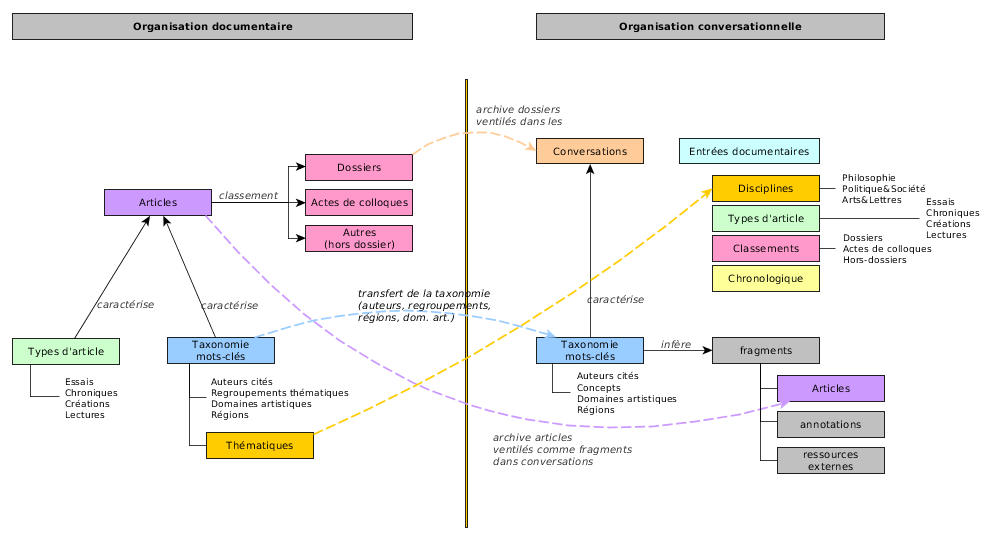
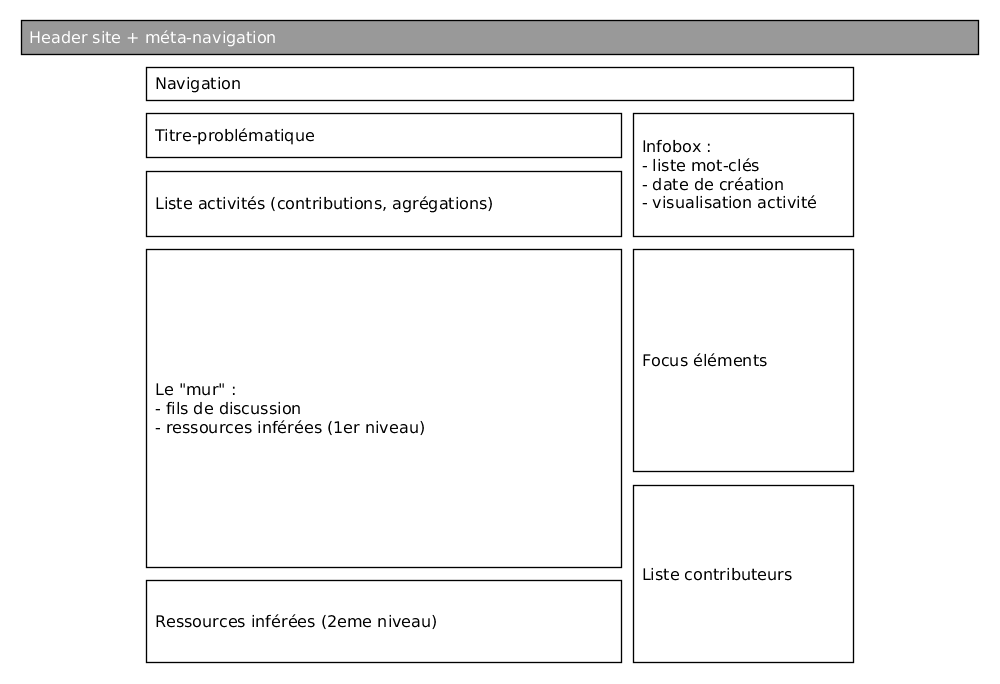
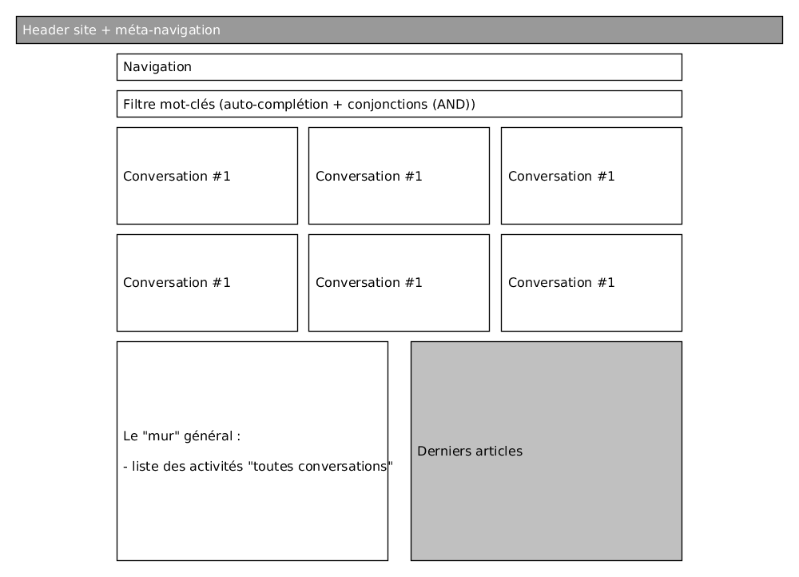
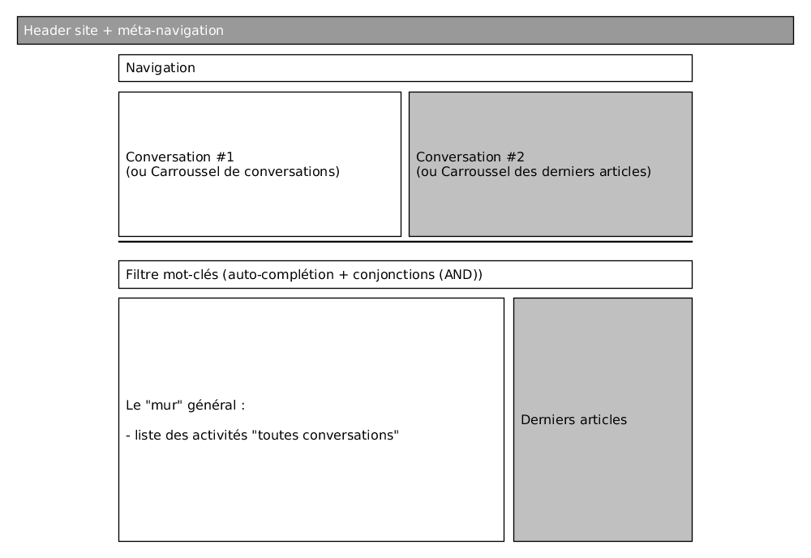
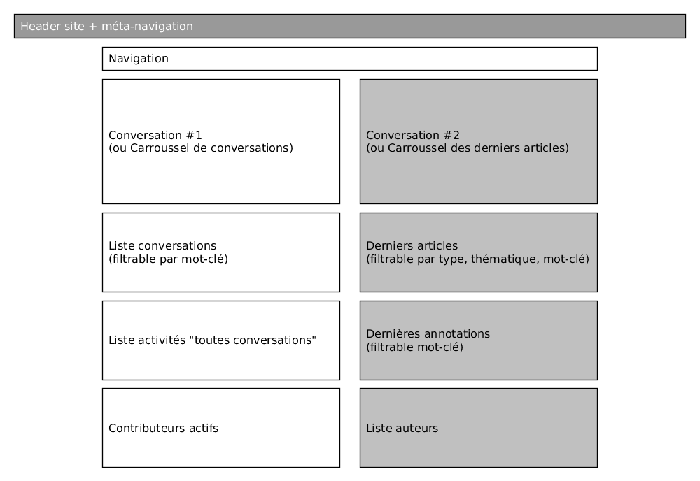

# Conversations - spécifications

Ce document fait état du design éditorial assurant le passage de l'organisation documentaire du site actuel à l'organisation conversationnelle du site futur.

## Rappel des éléments éditoriaux :

> nb: les différents objets sont décrits [dans le cahiers des charges](./cahiersDesCharges.md#définitions).

**Classement des articles :**

Un article appartient de manière exclusive à l'une de ces trois catégories de classement :

1. les dossiers : 21 dossiers, alimentés en continu ou figé.
2. les actes de colloques : 10 actes de colloques.
3. les articles hors-dossiers : tous les autres articles.

**Types d'articles :**

Chaque article est caractérisé par un et un seul type d'article.

1. essai. 
   La catégorie "essai" n'est pas exclusive. Ca veut dire que toute chronique, création, lecture peut être un essai.
 critère académique (longueur, référence bibliographique, évaluation par les pairs).
   actuellement sur SPIP, il y a des chroniques ou lectures qui ont un mot-clé "essai", qui permet à ces contenus d'être récupérés comme essai sur SPIP.
2. chronique
3. création
4. lecture
5. entretien

**Taxonomie de mots-clés :**

Les mots-clés contrôlés sont regroupés en taxonomies, et sont alignés sur rameau.bnf.fr.
Chaque article est caractérisé par un ou plusieurs mots-clés de chaque taxonomie.

La taxonomie définit 5(+1) groupes de mots-clés :

1. auteurs cités
2. regroupements thématiques (concepts)
3. domaines artistiques
4. régions
5. thématiques
6. (médias)

## Un nouvel objet : "la conversation"

La conversation peut être pensée comme la cristallisation de _fragments_ autour d'une problématique donnée, qu'elle soit identifiée par l'équipe éditoriale ou par la communauté.

Une conversation est donc l'aggrégation d'un ensemble de fragments :  de.s fil.s de discussion, des annotations d'article, des articles, des fragments de document, des ressources externes, participants (contributeurs).

La dimension temporelle du flux de la discussion reste structurante, mais s'articule avec une dimension spatiale, celle de l'agencement des différents fragments. Elle sera donc le résultat d'une éditorialisation à la fois :

1. éditoriale : sélection de mots-clés, paramétrage de l'algorithme, mise en avant d'éléments pertinents (fils de discussion)
2. communautaire : contributions de contenus (ressources et fragments), vote/classement des différents fragments.
3. algorithmique : extraction, classement et agencement des différents fragments (requêtes API).

Elle se caractérise par :

  * un titre en forme de **problématique**.
  * des mots-clés,
    * issus de la taxonomie de l'ancien site : auteurs cités, regroupements thématiques, régions, domaines artistiques.
  * un ou plusieurs fils de discussion associés
  * des **fragments inférés**, et en particulier :
    * annotation.s d'article et fil.s de discussion associé.s
    * articles et fragments d'article
    * ressources externes

L'agrégation des contenus se base sur les mots-clés **et les opérations logiques associées**. Exemple : `(citedAuthor:"Derrida" AND (concept:"capitalisme" OR concept:"communisme"))`

## Du documentaire au conversationnel

La définition de l'objet _Conversation_ nécessite de prendre en compte les archives de la revue et d'assurer en quelque sorte une rétrocompatibilité de l'organisation documentaire dans le nouveau site.

Le schéma suivant présente les grands principes du passage de l'un à l'autre et la correspondance des éléments éditoriaux.

Soit les correspondances suivantes :

**Dossiers >> Conversations**

Les 21 _dossiers_ existants seront ventilés dans des _conversations_ créées sur mesure. Au lieu d'être caractérisée par un titre et une série d'articles, la conversation est caractérisée d'abord par ses mots-clés, déterminant par inférence une liste d'articles (et autres fragments) à agréger à la conversation.

Les nouvelles conversations pourront faire l'objet d'un _appel à conversation_ sous la forme de ...

**Articles >> Articles**

Les articles ne seront plus _classés_ à proprement parlé, mais viendront s'agréger dans les différentes conversations selon la configuration de leurs mots-clés.

> Remarque : il ne sera pas possible de ventiler l'ensemble de l'archive dans des conversations. Il est préférable de ne pas produire de bruit, et de laisser des articles temporairement hors-conversation, jusqu'à ce qu'une conversation émerge et "fasse appel" à des articles non-encore considérés. Ces articles là resteront accessible à travers l'entrée documentaire (voir ci-dessous) et le moteur de recherche.

**Taxonomie >> Taxonomie**

Les mots-clés de la taxonomie Spip sont distribués selon 5(+1) catégories de mots-clés. Quatre catégories parmi les cinq principales seront utilisées pour caractériser les conversations, à savoir : auteurs cités, regroupements thématiques, régions, domaines artistiques. Les _Thématiques_ ne sont pas prises en compte dans l'agrégation des articles (voir ci-dessous).

**Entrées documentaires**

En complémentarité avec l'entrée conversationnelle, la revue proposera une navigation plus classique reprenant les différents éléments éditoriaux de l'ancien site (voir [Définition de la home](./)). On retrouvera alors un menu dédié proposant 4 entrées documentaires :

1. **Thématiques >> Disciplines**
   Les thématiques sont une catégorie de mots-clés contrôlés. Elles ne seront pas structurantes dans le paradigme conversationnel, mais resteront un point d'entrée documentaire en tant que _disciplines_
2. **Types d'articles**, dans lequel on retrouvera les 4 types existants.
3. **Classements** en dossiers et actes de colloques
4. **Chronologie** pour une liste exhaustive des articles ordonnés par date.

## Mockups

### Conversation

à noter : le bloc "Focus" se mettra à jour au clic ou au passage de la souris sur un élément de la page : fragment, annotation, article, auteur/contributeur, etc. pour présenter les informations relatives à cet élément.

Comme pour la home, un champs de filtre/recherche par mot-clé pourrait venir filtrer les blocs "mur", activités, ressources.

### Home

Premier jet de 3 propositions comme point de départ de réflexion :

1. 
* Le filtrage par mot-clé se fait sans recharger la page et opère sur tous cadres : liste conversations, liste articles, liste activités. Principe à décliner sur l'ensemble du site, le mot-clé devient structurant dans la navigation.

2. 

3. 
  * Dans cette proposition, on donne une place équivalente aux conversations et aux articles.
